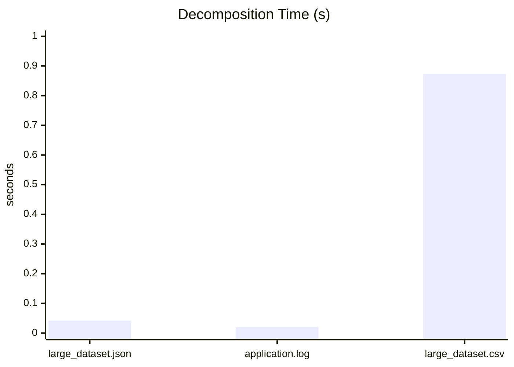
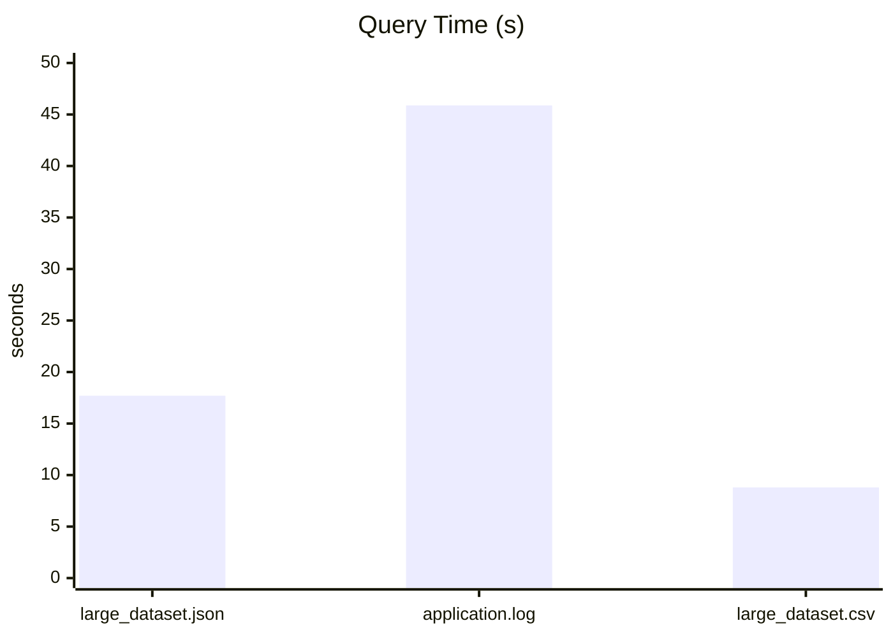
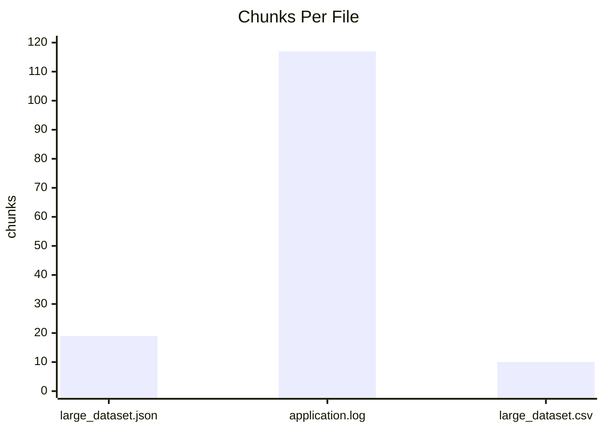

# RLM Plugin for Claude Code

Process data that exceeds an LLM context window by chunking, parallel extraction, and synthesis.

## What it does

RLM breaks large inputs into chunks, runs per-chunk extraction in parallel, then (optionally) runs a synthesis pass to produce a single answer.

```
Input (large file)
  |
  |-- Chunk 0 -> LLM -> per-chunk findings
  |-- Chunk 1 -> LLM -> per-chunk findings
  |-- ...
  `-- Chunk N -> LLM -> per-chunk findings
  |
  `-- Synthesis -> unified answer
```

## When to use it

Use RLM when the input is too large for a single LLM call:

- JSON/CSV/logs that are hundreds of KB to multiple MB
- Large codebases or multi-file analysis

Do not use RLM for small inputs. If content fits comfortably in context, direct processing is faster, cheaper, and usually more accurate.

## Real results (from an OpenRouter run)

These numbers are from a real run on 2026-02-12 using `OPENROUTER_API_KEY` with the default OpenRouter model mapping (haiku tier -> `google/gemini-2.5-flash`). The commands run were:

```
python3 test_fixed_plugin.py
python3 test_real_world_comparison.py
```

### Large-file comparison (benchmarks/test_data)

| File | Size | Strategy | Chunks | Decomp time | Query time |
| --- | --- | --- | --- | --- | --- |
| large_dataset.json | 3.4MB | structural_decomp | 19 | 0.042s | 17.700s |
| application.log | 5.0MB | token_chunking | 117 | 0.020s | 45.880s |
| large_dataset.csv | 2.3MB | structural_decomp | 10 | 0.873s | 8.798s |

Notes:
- Decomposition time is measured separately from query time.
- Decomposition throughput in the test output is based on file size / decomposition time only.
- Query time depends on backend latency, model speed, and network conditions.

### Graphs (same run)

Decomposition time (seconds):



Query processing time (seconds):



Chunks per file:



### Smaller file tests (test_fixed_plugin.py)

- 307,783-byte text file -> `file_chunking`, 15 chunks
- 360,313-byte JSON -> `structural_decomp`, 15 chunks
- 1,653-byte code file -> direct query (no chunking)

### About token estimates

The comparison output shows an estimated token count (~888,000 for the 3.4MB JSON) and a token-per-chunk estimate derived from file size / chunk count. This is an approximation, not a real tokenizer measurement. If you need exact token counts, use a tokenizer for your target model.

## Setup

```
git clone https://github.com/Plasma-Projects/claude-code-rlm-plugin.git
cd claude-code-rlm-plugin
pip install anthropic  # or: pip install openai
```

### Authentication (pick one)

```
# Option 1: OpenRouter (recommended)
export OPENROUTER_API_KEY="sk-or-v1-..."

# Option 2: Anthropic API
export ANTHROPIC_API_KEY="sk-ant-..."

# Option 3: OpenAI
export OPENAI_API_KEY="sk-..."

# Option 4: Local (Ollama)
ollama serve

# Option 5: Inside Claude Code (auto)
# No config needed, but slower per chunk
```

Backend priority: Anthropic > OpenAI > OpenRouter > Local > Claude CLI > Fallback

## Usage

```python
from src import RLMPlugin

rlm = RLMPlugin()

# Process a large file with a query
result = rlm.process(
    file_path="/path/to/massive.json",
    query="What are the top 10 users by score?"
)

print(result["synthesis_applied"])  # True or False
print(result["result"]["aggregated"])  # Unified answer

# Process content string
result = rlm.process(
    content=large_string,
    query="Summarize key findings"
)

# Check backend status
print(rlm.get_llm_status())
```

### Multi-file processing

```python
result = rlm.process(
    file_path=["/path/a.json", "/path/b.csv"],
    query="Compare key trends"
)
```

### REPL mode

```python
with rlm.repl_session() as repl:
    repl.load_file("/path/to/data.csv")
    result = repl.evaluate("llm_query('Find anomalies', context)")
```

## Configuration

Configuration is loaded from `.claude-plugin/plugin.json`. Defaults:

- auto_trigger.file_size_kb (default: 50)
- auto_trigger.token_count (default: 100000)
- auto_trigger.file_count (default: 10)
- processing.max_concurrent_agents (default: 8)
- processing.chunk_overlap_percent (default: 10)
- processing.recursion_depth_limit (default: 2)
- processing.chunk_size (default: 50000)
- models.extraction (default: haiku)
- models.analysis (default: sonnet)
- models.orchestration (default: sonnet)

## Architecture

```
RLMPlugin
|-- ContextRouter         (decides when to activate, selects chunking strategy)
|-- ParallelAgentManager  (parallel chunk processing + synthesis)
|-- LLMManager            (Anthropic/OpenAI/OpenRouter/Local/Claude CLI/Fallback)
`-- REPLEngine            (interactive processing)
```

### Chunking strategies

| Data type | Strategy | How it splits |
| --- | --- | --- |
| JSON/YAML/XML/CSV | Structural decomposition | Top-level keys / row batches |
| Logs | Time window | Timestamp or line windows |
| Text/Code | File chunking | Overlapping chunks |

## Limitations

- Counts across chunks can be approximate; overlap and synthesis can skew totals.
- Results depend on per-chunk extraction quality and the synthesis model.
- Claude CLI backend can be slow or unavailable in some environments.

## Reproduce the benchmark output

```
export OPENROUTER_API_KEY="sk-or-v1-..."
python3 test_fixed_plugin.py
python3 test_real_world_comparison.py
```

## License

MIT
